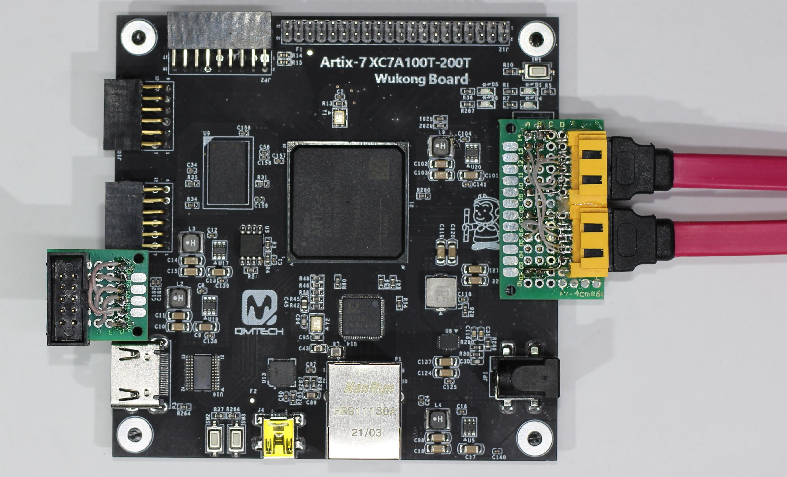
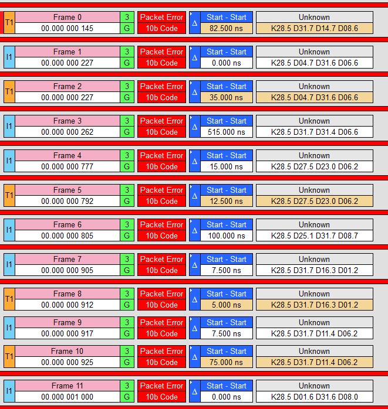

# SATA_IBERT
Run IBERT testing with SATA2 speed parameters on Virtex-6 and Artix-7 FPGAs

SATAphy3a7.zip - IBERT SATA project for Wukong board (https://github.com/ChinaQMTECH/XC7A100T-200T_Wukong_Board)

SATAphy3v6.zip - IBERT SATA project for XC6VLX365T PCIE SFP+ board from aliexpress. 

blog record about this project: https://blog.rlab.ru/konstruktsiya-interfeysa-sata-chast-6-1034.html

autor email: s@rlab.ru
